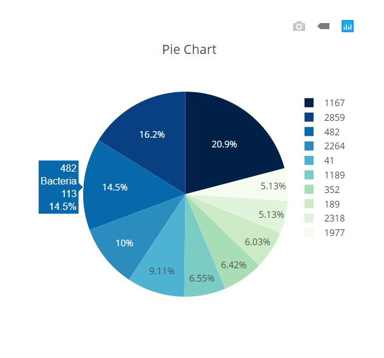

# Interactive Visualizations with Python, SQLAlchemy, Flask, D3.js, Plotly.js, and Heroku!

<br>

## B<sup>3</sup> Dashboard: Bellybutton Biodiversity

Check out my [B<sup>3</sup> Dashboard on Heroku](https://b3-dashboard.herokuapp.com/).

<br>

<div align='center'></div>

<br>

## Overview

When I first set out to make the dashboard for this project, I had [a CSV file with survey information about people's bellybuttons](data/b_b_data.csv) and [another CSV file with close analyses of bacteria samples from their belly buttons](b_b_metadata.csv). This seems a little gross, but this data was formatted in a good way to be able to learn how to make a Heroku app with Python and Flask. So after loading these files into a SQL database and saving as .sqlite files, I was able to begin building my dashboard.

<br>

## Building Components of Interactive Dashboard

#### Set up routes in [app.py](app.py) to run with Flask

First, I imported standard and third party imports.

<br>

```python
# standard library imports
import pandas as pd
import numpy as np

# third party imports
import sqlalchemy
from sqlalchemy.ext.automap import automap_base
from sqlalchemy.orm import Session
from sqlalchemy import create_engine
from flask import Flask, jsonify, render_template
from flask_sqlalchemy import SQLAlchemy
```

<br>

Then I set up the Flask constructor and database with SQLAlchemy and the .sqlite files. This was reflected into a new model using ```automap_base()``` that could then have references to each table saved as variables ```Samples_Metadata``` and ```Samples```.

<br>

```python
# Flask constructor
app = Flask(__name__)

# setup database
app.config['SQLALCHEMY_DATABASE_URI'] = 'sqlite:///data/bb.sqlite'
db = SQLAlchemy(app)

# reflect an existing database into a new model
Base = automap_base()

# reflect the tables
Base.prepare(db.engine, reflect=True)

# save references to each table
Samples_Metadata = Base.classes.sample_metadata
Samples = Base.classes.samples
```

<br>

Next were my routes. I made four total: index, names, sample_metadata, and samples. In the index route, I simply returned my ```index.html``` which is the homepage.

<br>

```python
# set up home route
@app.route('/')
def index():
    '''Return the homepage.'''
    return render_template('index.html')
```

<br>

In the names route, I returned a jsonified list of names that had been queried and saved into a pandas dataframe.

<br>

```python
# set up names route
@app.route('/names')
def names():
    '''Return a list of sample names.'''

    # sql query with pandas
    stmt = db.session.query(Samples).statement
    df = pd.read_sql_query(stmt, db.session.bind)

    # return column names (sample names) list
    return jsonify(list(df.columns)[2:])
```

<br>

In the sample_metadata route, I made a list of the 7 things I wanted to query and added a filter that would give me whatever information for each sample saved into the variable ```results```. Then for each sample in the results, I added each index of information to a particular column in an empty dictionary called ```sample_metadata```. Last, I returned a jsonified version of this dictionary of sample metadata. 

<br>

```python
# set up metadata route (profile of people)
@app.route('/metadata/<sample>')
def sample_metadata(sample):
    '''Return the MetaData for a given sample.'''
    sel = [
        Samples_Metadata.sample,
        Samples_Metadata.ETHNICITY,
        Samples_Metadata.GENDER,
        Samples_Metadata.AGE,
        Samples_Metadata.LOCATION,
        Samples_Metadata.BBTYPE,
        Samples_Metadata.WFREQ,
    ]

    # sql query of all samples
    results = db.session.query(*sel).filter(Samples_Metadata.sample == sample).all()

    # dictionary of sample metadata
    sample_metadata = {}
    for result in results:
        sample_metadata['Sample'] = result[0]
        sample_metadata['Ethnicity'] = result[1]
        sample_metadata['Gender'] = result[2]
        sample_metadata['Age'] = result[3]
        sample_metadata['Location'] = result[4]
        sample_metadata['Belly Button Type'] = result[5]
        sample_metadata['Wash frequency'] = result[6]

    # print dictionary and return jsonified sample dictionary
    print(sample_metadata)
    return jsonify(sample_metadata)
```

<br>

In the samples route, I made another dataframe of a query of samples, exactly as I did in the names route. But then I filtered this data by the sample number, only keeping those greater than 1, and then sorted in descending order. I converted sections of this ```sample_data``` into lists inside a ```data``` dictionary that was returned in jsonified format.

<br>

```python
# set up sample route
@app.route('/samples/<sample>')
def samples(sample):
    '''Return `otu_ids`, `otu_labels`,and `sample_values`.'''

    # sql query with pandas
    stmt = db.session.query(Samples).statement
    df = pd.read_sql_query(stmt, db.session.bind)

    # filter data by sample number / only keep values > 1
    sample_data = df.loc[df[sample] > 1, ['otu_id', 'otu_label', sample]]

    # sort by sample
    sample_data.sort_values(by=sample, ascending=False, inplace=True)

    # jsonify data
    data = {
        'otu_ids': sample_data.otu_id.values.tolist(),
        'sample_values': sample_data[sample].values.tolist(),
        'otu_labels': sample_data.otu_label.tolist(),
    }
    return jsonify(data)
```

<br>

Finally, I used ```if __name__ == '__main__'``` to run my app with debugging since [my module is the main program](https://stackoverflow.com/a/419185) and isn't being imported by another program.

<br>

```python
if __name__ == '__main__':
    app.run(debug=True)
```

<br>

#### Prepare [app.js](app.js) with [Plotly JavaScript Open Source Graphing Library](https://plot.ly/javascript/)

My first step in writing my app.js file was to create a function called ```buildMetadata()``` that would build all the metadata with ```d3.json``` into a panel/card in the corresponding part of the HTML with ```d3.select``` and would include the keys and values of each sample.

<br>

```javascript
function buildMetadata(sample) {
  // fetch sample metadata
  let metadataURL = '/metadata/' + sample

  // select panel
  let panelMetadata = d3.select('#sample-metadata')

  // clear any existing metadata
  panelMetadata.html('')

  // append new tags for each key value
  d3.json(metadataURL).then(function(data) {
    Object.entries(data).forEach(([key, value]) => {
      panelMetadata.append('h6').text(`${key}: ${value}`)
    })
  })

}
```

<br>

<div align='center'></div>

<br>

Then I made a function to build two styles of charts from the same data: a pie chart and a bubble chart. I used [Colorbrewer](http://colorbrewer2.org/?type=sequential&scheme=GnBu&n=9) for the color scheme and added a darker color to round it out to ten since 9 was the highest option for a sequential scheme. I also figured out how to [make my own colorscale in Python](https://plot.ly/python/colorscales/) instead of using a preset color such as 'Viridis'. This was in order to match the colors I chose from Colorbrewer.

The buildCharts function uses ```d3.json``` to get the appropriate data for the charts. Then it plots a pie chart with ```Plotly.newPlot``` which implements the ```trace``` and ```layout``` variables declared just before. Finally, it plots a bubble chart in the same way, this time with the ```trace1``` and ```layout1``` variables declared just before. I might change these variable names to be a little more clear for others trying to learn from this.

<br>

```javascript
function buildCharts(sample) {
  // fetch sample data for plots
  let chartsURL = '/samples/' + sample

  // build two charts
  d3.json(chartsURL).then(function(data) {
    
    // build pie chart
    let trace = [{
      values: data.sample_values.slice(0,10),
      labels: data.otu_ids.slice(0,10),
      hovertext: data.otu_labels.slice(0,10),
      type: 'pie',
      marker: {
        colors: ['#002047','#084081', '#0868ac', '#2b8cbe', '#4eb3d3', '#7bccc4', '#a8ddb5', '#ccebc5', '#e0f3db' ,'#f7fcf0']
      }
    }]

    let layout = {
      title: {
        text: 'Pie Chart'
      },
      showlegend: true
    }

    Plotly.newPlot('pie', trace, layout)

    // build bubble chart
    let trace1 = [{
      x: data.otu_ids,
      y: data.sample_values,
      mode: 'markers',
      text: data.otu_labels,
      marker: {
        color: data.otu_ids,
        size: data.sample_values,
        colorscale: [[0, '#002047'], [0.1, '#002047'],
          [0.1, '#084081'], [0.2, '#084081'],
          [0.2, '#0868ac'], [0.3, '#0868ac'], 
          [0.3, '#2b8cbe'], [0.4, '#2b8cbe'],
          [0.4, '#4eb3d3'], [0.5, '#4eb3d3'],
          [0.5, '#7bccc4'], [0.6, '#7bccc4'],
          [0.6, '#a8ddb5'], [0.7, '#a8ddb5'],
          [0.7, '#ccebc5'], [0.8, '#ccebc5'],
          [0.8, '#e0f3db'], [0.9, '#e0f3db'],
          [0.9, '#f7fcf0'], [1.0, '#f7fcf0']]
      }
    }]
    
    let layout1 = {
      title: {
        text: 'Bubble Chart'
      },
      xaxis: {
        title: {
          text: 'OTU ID'
        }
      },
      showlegend: false,
      height: 600,
      width: 1500
    }

    Plotly.newPlot('bubble', trace1, layout1)
  })
}
```

<br>

Pie Chart:

<br>

<div align='center'></div>

<br>

Bubble Chart:

<br>

<div align='center'></div>

<br>

I made two more functions: ```init()``` and ```optionChanged()```. The ```init()``` function just initializes the build of the first sample. The ```optionChanged()``` function updates the previous functions ```buildCharts()``` and ```buildMetadata()``` when a new sample is selected by the user from the dropdown in the metadata panel.

<br>

```javascript
function init() {
  // grab a reference to the dropdown select element
  let selector = d3.select('#selDataset')

  // use the list of sample names to populate the select options
  d3.json('/names').then((sampleNames) => {
    sampleNames.forEach((sample) => {
      selector
        .append('option')
        .text(sample)
        .property('value', sample)
    })

    // use the first sample from the list to build the initial plots
    let firstSample = sampleNames[0]
    buildCharts(firstSample)
    buildMetadata(firstSample)
  })
}

function optionChanged(newSample) {
  // fetch new data each time a new sample is selected
  buildCharts(newSample)
  buildMetadata(newSample)
}

// initialize the dashboard
init()
```

<br>

Here is an example of two different options selected from the dropdown.

<br>

<div align='center'></div>

<br>

#### Render template

In [index.html](templates/index.html), I used [Bootstrap](https://getbootstrap.com/docs/4.0/getting-started/introduction/) to create a jumbotron and a card with sample picker and sample results (panel was used in the previous versions of Bootstrap). It also allowed me to organize my columns to have the pie chart next to the panel of metadata and the bubble chart along the bottom taking up the entire width of the screen.

<br>

```html
<!DOCTYPE html>
<html lang='en'>
<head>
  <meta charset='UTF-8'>
  <meta name='viewport' content='width=device-width, initial-scale=1.0'>
  <meta http-equiv='X-UA-Compatible' content='ie=edge'>
  <title>B&sup3; Dashboard</title>
  <link rel='stylesheet' href='https://maxcdn.bootstrapcdn.com/bootstrap/4.0.0/css/bootstrap.min.css' integrity='sha384-Gn5384xqQ1aoWXA+058RXPxPg6fy4IWvTNh0E263XmFcJlSAwiGgFAW/dAiS6JXm' crossorigin='anonymous'>
  <link href='https://fonts.googleapis.com/css?family=Gayathri&display=swap' rel='stylesheet'>
</head>
<body style='font-family: "Gayathri", sans-serif;'>
  <div class='jumbotron jumbotron-fluid text-center' style='background-color:#4eb3d3; color:white;'>
    <h1>B&sup3; Dashboard</h1>
    <h5>Use the interactive charts below to explore the belly button biodiversity dataset</h5>
  </div>
  <div class='container'>
    <div class='row justify-content-center'>
      <div class='col-md-4'>
        <div class='card'>
          <div class='card-header' style='background-color:#4eb3d3; color:white;'><h3>Sample Metadata</h3></div>
          <div class='card-body'>
            <div class='card-text'><h5>Select Sample:</h5><select id='selDataset' onchange='optionChanged(this.value)'></select></div>
            <br><hr>
            <div id = 'sample-metadata' class='card-text'></div>
          </div>
        </div>
      </div>
      <div class='col-md-5'>
        <div id='pie'></div>
      </div>
    </div>
  </div>
  <div class='row'>
    <div class='col'>
      <div id='bubble'></div>
    </div>
  </div>
  <script src='https://d3js.org/d3.v5.min.js'></script>
  <script src='https://cdn.plot.ly/plotly-latest.min.js'></script>
  <script src='{{ url_for("static", filename="js/app.js") }}'></script>
</body>
</html>
```

<br>

#### Run Flask

I used Flask to run the app in my local environment.

<br>

<div align='center'></div>

<br>

I was able to quickly see how the dropdown functioned and whether the charts updated when a new sample was selected.

<br>

<div align='center'></div>

<br>

#### Deploy to Heroku

I wanted to deploy my app to Heroku so that others could test out the functionality as well. But this was a frustrating step. It took a long time, and it ended up being the simplest little fix. That's how programming goes. So in the future, I will be less stubborn about trying to figure this out by myself and just ask for help after a much shorter time of struggling on my own.

The steps I took to deploy my app to Heroku were actually pretty simple. I logged into my Heroku account through Google Chrome.