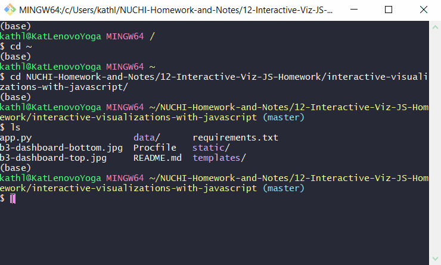
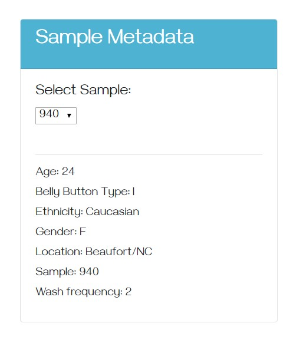

# Interactive Visualizations with JavaScript, D3, and Plotly

## Current B<sup>3</sup> Dashboard

[](https://b3-dashboard.herokuapp.com/)

#### Run Flask

<p align='center'></p>
<br>

#### Initial View

<p align='center'></p>

<br>

## Building Components of Interactive Dashboard

#### Set up routes in [app.py](app.py) to run with Flask

```python
# standard library imports
import pandas as pd
import numpy as np

# third party imports
import sqlalchemy
from sqlalchemy.ext.automap import automap_base
from sqlalchemy.orm import Session
from sqlalchemy import create_engine
from flask import Flask, jsonify, render_template
from flask_sqlalchemy import SQLAlchemy

# Flask constructor
app = Flask(__name__)

# setup database
app.config['SQLALCHEMY_DATABASE_URI'] = 'sqlite:///data/bb.sqlite'
db = SQLAlchemy(app)

# reflect an existing database into a new model
Base = automap_base()

# reflect the tables
Base.prepare(db.engine, reflect=True)

# save references to each table
Samples_Metadata = Base.classes.sample_metadata
Samples = Base.classes.samples

# set up home route
@app.route('/')
def index():
    '''Return the homepage.'''
    return render_template('index.html')

# set up names route
@app.route('/names')
def names():
    '''Return a list of sample names.'''

    # sql query with pandas
    stmt = db.session.query(Samples).statement
    df = pd.read_sql_query(stmt, db.session.bind)

    # return column names (sample names) list
    return jsonify(list(df.columns)[2:])

# set up metadata route (profile of people)
@app.route('/metadata/<sample>')
def sample_metadata(sample):
    '''Return the MetaData for a given sample.'''
    sel = [
        Samples_Metadata.sample,
        Samples_Metadata.ETHNICITY,
        Samples_Metadata.GENDER,
        Samples_Metadata.AGE,
        Samples_Metadata.LOCATION,
        Samples_Metadata.BBTYPE,
        Samples_Metadata.WFREQ,
    ]

    # sql query of all samples
    results = db.session.query(*sel).filter(Samples_Metadata.sample == sample).all()

    # dictionary of sample metadata
    sample_metadata = {}
    for result in results:
        sample_metadata['Sample'] = result[0]
        sample_metadata['Ethnicity'] = result[1]
        sample_metadata['Gender'] = result[2]
        sample_metadata['Age'] = result[3]
        sample_metadata['Location'] = result[4]
        sample_metadata['Belly Button Type'] = result[5]
        sample_metadata['Wash frequency'] = result[6]

    # print dictionary and return jsonified sample dictionary
    print(sample_metadata)
    return jsonify(sample_metadata)

# set up sample route
@app.route('/samples/<sample>')
def samples(sample):
    '''Return `otu_ids`, `otu_labels`,and `sample_values`.'''

    # sql query with pandas
    stmt = db.session.query(Samples).statement
    df = pd.read_sql_query(stmt, db.session.bind)

    # filter data by sample number / only keep values > 1
    sample_data = df.loc[df[sample] > 1, ['otu_id', 'otu_label', sample]]

    # sort by sample
    sample_data.sort_values(by=sample, ascending=False, inplace=True)

    # jsonify data
    data = {
        'otu_ids': sample_data.otu_id.values.tolist(),
        'sample_values': sample_data[sample].values.tolist(),
        'otu_labels': sample_data.otu_label.tolist(),
    }
    return jsonify(data)

if __name__ == '__main__':
    app.run(debug=True)
```


#### Prepare [app.js](app.js) with [Plotly JavaScript Open Source Graphing Library](https://plot.ly/javascript/)

First, I made a function that would build all the metadata into a panel/card with the keys and values of each.

```javascript
function buildMetadata(sample) {
  // fetch sample metadata
  let metadataURL = '/metadata/' + sample

  // select panel
  let panelMetadata = d3.select('#sample-metadata')

  // clear any existing metadata
  panelMetadata.html('')

  // append new tags for each key value
  d3.json(metadataURL).then(function(data) {
    Object.entries(data).forEach(([key, value]) => {
      panelMetadata.append('h6').text(`${key}: ${value}`)
    })
  })

}
```

<br>

<p align='center'></p>

<br>

Then I made a function to build two styles of charts from the same data: a pie chart and a bubble chart. I used [Colorbrewer](http://colorbrewer2.org/?type=sequential&scheme=GnBu&n=9) for the color scheme and added a darker color to round it out to ten since 9 was the highest option for a sequential scheme. I also figured out how to [make my own colorscale in Python](https://plot.ly/python/colorscales/) instead of using a preset color such as 'Viridis'. This was in order to match the colors I chose from Colorbrewer.

```javascript
function buildCharts(sample) {
  // fetch sample data for plots
  let chartsURL = '/samples/' + sample

  // build two charts
  d3.json(chartsURL).then(function(data) {
    
    // build pie chart
    let trace = [{
      values: data.sample_values.slice(0,10),
      labels: data.otu_ids.slice(0,10),
      hovertext: data.otu_labels.slice(0,10),
      type: 'pie',
      marker: {
        colors: ['#002047','#084081', '#0868ac', '#2b8cbe', '#4eb3d3', '#7bccc4', '#a8ddb5', '#ccebc5', '#e0f3db' ,'#f7fcf0']
        // http://colorbrewer2.org/?type=sequential&scheme=GnBu&n=9
      }
    }]

    let layout = {
      title: {
        text: 'Pie Chart'
      },
      showlegend: true
    }

    Plotly.newPlot('pie', trace, layout)

    // build bubble chart
    let trace1 = [{
      x: data.otu_ids,
      y: data.sample_values,
      mode: 'markers',
      text: data.otu_labels,
      marker: {
        color: data.otu_ids,
        size: data.sample_values,
        colorscale: [[0, '#002047'], [0.1, '#002047'],
          [0.1, '#084081'], [0.2, '#084081'],
          [0.2, '#0868ac'], [0.3, '#0868ac'], 
          [0.3, '#2b8cbe'], [0.4, '#2b8cbe'],
          [0.4, '#4eb3d3'], [0.5, '#4eb3d3'],
          [0.5, '#7bccc4'], [0.6, '#7bccc4'],
          [0.6, '#a8ddb5'], [0.7, '#a8ddb5'],
          [0.7, '#ccebc5'], [0.8, '#ccebc5'],
          [0.8, '#e0f3db'], [0.9, '#e0f3db'],
          [0.9, '#f7fcf0'], [1.0, '#f7fcf0']]
          // https://plot.ly/python/colorscales/
      }
    }]
    
    let layout1 = {
      title: {
        text: 'Bubble Chart'
      },
      xaxis: {
        title: {
          text: 'OTU ID'
        }
      },
      showlegend: false,
      height: 600,
      width: 1500
    }

    Plotly.newPlot('bubble', trace1, layout1)
  })
}
```

Pie Chart:

<p align='center'></p>

<br>

Bubble Chart:

<p align='center'></p>

<br>

Then, I made two functions: init and optionChanged. The init function just initializes the build of the first sample. The optionChanged function updates the previous functions buildCharts and buildMetadata when a new sample is selected by the user from the d3 selector (displayed in the metadata panel).

```javascript
function init() {
  // grab a reference to the dropdown select element
  let selector = d3.select('#selDataset')

  // use the list of sample names to populate the select options
  d3.json('/names').then((sampleNames) => {
    sampleNames.forEach((sample) => {
      selector
        .append('option')
        .text(sample)
        .property('value', sample)
    })

    // use the first sample from the list to build the initial plots
    let firstSample = sampleNames[0]
    buildCharts(firstSample)
    buildMetadata(firstSample)
  })
}

function optionChanged(newSample) {
  // fetch new data each time a new sample is selected
  buildCharts(newSample)
  buildMetadata(newSample)
}

// initialize the dashboard
init()
```

<p align='center'></p>

<br>

#### Render template

In [index.html](templates/index.html), I used [Bootstrap](https://getbootstrap.com/docs/4.0/getting-started/introduction/) to create a jumbotron, card with sample picker and sample results (panel was used in the previous versions of Bootstrap), a pie chart, and a bubble chart.

```html
<!DOCTYPE html>
<html lang='en'>
<head>
  <meta charset='UTF-8'>
  <meta name='viewport' content='width=device-width, initial-scale=1.0'>
  <meta http-equiv='X-UA-Compatible' content='ie=edge'>
  <title>B&sup3; Dashboard</title>
  <link rel='stylesheet' href='https://maxcdn.bootstrapcdn.com/bootstrap/4.0.0/css/bootstrap.min.css' integrity='sha384-Gn5384xqQ1aoWXA+058RXPxPg6fy4IWvTNh0E263XmFcJlSAwiGgFAW/dAiS6JXm' crossorigin='anonymous'>
  <link href='https://fonts.googleapis.com/css?family=Gayathri&display=swap' rel='stylesheet'>
</head>
<body style='font-family: "Gayathri", sans-serif;'>
  <div class='jumbotron jumbotron-fluid text-center' style='background-color:#4eb3d3; color:white;'>
    <h1>B&sup3; Dashboard</h1>
    <h5>Use the interactive charts below to explore the belly button biodiversity dataset</h5>
  </div>
  <div class='container'>
    <div class='row justify-content-center'>
      <div class='col-md-4'>
        <div class='card'>
          <div class='card-header' style='background-color:#4eb3d3; color:white;'><h3>Sample Metadata</h3></div>
          <div class='card-body'>
            <div class='card-text'><h5>Select Sample:</h5><select id='selDataset' onchange='optionChanged(this.value)'></select></div>
            <br><hr>
            <div id = 'sample-metadata' class='card-text'></div>
          </div>
        </div>
      </div>
      <div class='col-md-5'>
        <div id='pie'></div>
      </div>
    </div>
  </div>
  <div class='row'>
    <div class='col'>
      <div id='bubble'></div>
    </div>
  </div>
  <script src='https://d3js.org/d3.v5.min.js'></script>
  <script src='https://cdn.plot.ly/plotly-latest.min.js'></script>
  <script src='{{ url_for("static", filename="js/app.js") }}'></script>
</body>
</html>
```